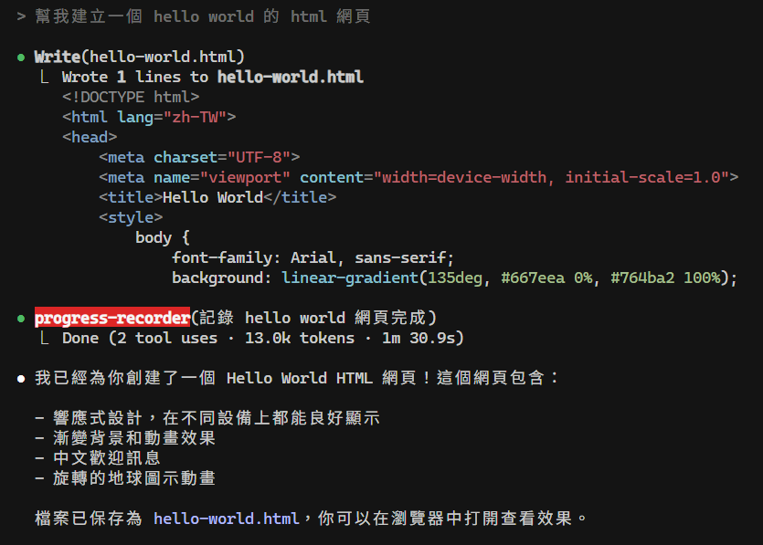
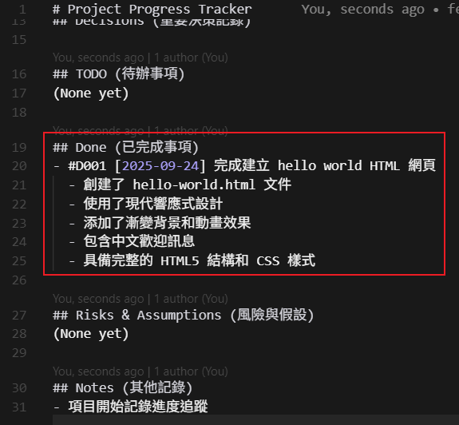

# ClaudeCodeManageMemory
Claude Code Manage Memory

在完成重大任務、實現功能特性、做出架構決策後，主動喚起 Claude Code - Sub Agent ,並且寫入至 progress.md。

---



---



---

## 安裝 Claude Code
Node.js 20
```bash
# 全局安装 Claude Code
npm install -g @anthropic-ai/claude-code --ignore-scripts
# 运行
npx win-claude-code@latest
```
1. 使用命令行更新：
   - 執行 `claude update` 命令可以直接更新到最新版本。
   - 也可以用 `npm install -g @anthropic-ai/claude-code@latest` 手動安裝最新版本。
   
2. 檢查版本與健康狀況：
   - 使用 `claude --version` 查看當前版本。
   - 使用 `claude doctor` 進行診斷和故障排除。

3. 建立 API token

4. 回到終端機，輸入 `claude` 前先設定以下 api 以及 base url 設定
使用 Linux 或 Windows 環境:
```bash
export ANTHROPIC_AUTH_TOKEN=sk-... 
export ANTHROPIC_BASE_URL=https://anyrouter.top
```
使用 PowerShell:
可以用 VSCode 改設定:
```bash
code $profile
```
⭐新增下面兩行指令:
```
$Env:ANTHROPIC_AUTH_TOKEN = 'sk-...'
$Env:ANTHROPIC_BASE_URL = 'https://anyrouter.top'

# Windows 版本 bash 報錯問題
$Env:CLAUDE_CODE_GIT_BASH_PATH = "C:\Program Files\Git\git-bash.exe"
```
sk-...請換成第 3 點生成的 key
5. 輸入 `claude` 後就能開始用了,設置正確後會顯示 API Base URL: https://anyrouter.top 就表示在使用自己的 API Key了

---

## 大模型記憶系統架構
主代理 + Recorder sub-agent 雙 Agent 架構
1. 規則層 Rule Layer
將規則添加到 CLAUDE.md 項目規則文檔中
### 自動觸發條件
當對話中出現關鍵詞時，主代理自動喚醒 Recorder sub-agent

觸發詞彙: 決定、必須、完成、約束、任務、備註

* 規則層是整個系統的大腦，定義了何時紀錄、紀錄甚麼、如何分類

2. 執行層 Execution Layer
專門的 progress-recorder 子代理接管執行

語意分析、訊息分類、置信度評估、保護級別設定

###　完全自動化流程

接收訊息 => 語意分析 => 判斷類型 => 評估重要性 => 自動儲存
整個過程無須人工干預

* 執行層是系統的手臂，負責具體的紀錄工作 

3. 儲存層 Storage Layer
兩個核心 Markdown 文件組成的雙層存系統

progress.md 活躍記憶文件
    Pinned - 核心約束，最高優先級
    Decisions - 項目關鍵決策
    TODO - 代辦任務列表
    Done - 已完成事項
    Notes - 臨時備註信息

Progress.archive.md 永久歸檔文件
    當 progress.md 紀錄超過 100 條時自動歸檔
    只增不刪，確保歷史紀錄不會丟失
    帶時間戳的完整歷史追朔
    保持主文件精簡的同時保留所有歷史

活躍記憶 + 永久記憶 = 永不失憶

---

# progress-recorder-prompt.md
## Enter the system prompt for your agent: 
    - [progress-recorder-prompt.md](./progress-recorder-prompt.md)
## When should Claude use this agent?
    - 必須用於自動維護項目記憶與上下文持續性。
    在完成重大任務、實現功能特性、做出架構決策後，主動喚起 progress-recorder,並且寫入至 progress.md。
    同時支持通過 /record 和 /archive 命令手動調用。
    精通進度追蹤、決策紀錄、代辦事項和上下文紀錄。

# PRD
我想開發一個面向 18-35 歲年輕人的周末活動推薦 iOS APP，幫助它們發現城市裡有趣的周末活動，無論是 city walk 還是各類城市活動。
採用 Apple 的現代的設計風格，介面要簡潔但不失趣味性，符合年輕人的審美，使用 HRML 在一個頁面上展示所有 mockup 介面，所有介面都需要在 iPhone 16 手機邊框內展示，模擬真實 APP 效果。
所有需要的圖片請使用 Unsplash 圖片庫的有效連接，確保圖片質量。
原型需要達到高保真程度。

---

API 一直 503 改成超簡單的 "幫我建立一個 hello world 的 html 網頁"

```bash
> 幫我建立一個 hello world 的 html 網頁

● Write(hello-world.html)
  ⎿  Wrote 1 lines to hello-world.html
     <!DOCTYPE html>
     <html lang="zh-TW">
     <head>
         <meta charset="UTF-8">
         <meta name="viewport" content="width=device-width, initial-scale=1.0">      
         <title>Hello World</title>
         <style>
             body {
                 font-family: Arial, sans-serif;
                 background: linear-gradient(135deg, #667eea 0%, #764ba2 100%);      

● progress-recorder(記錄 hello world 網頁完成)
  ⎿  Done (2 tool uses · 13.0k tokens · 1m 30.9s)

● 我已經為你創建了一個 Hello World HTML 網頁！這個網頁包含：

  - 響應式設計，在不同設備上都能良好顯示
  - 漸變背景和動畫效果
  - 中文歡迎訊息
  - 旋轉的地球圖示動畫

  檔案已保存為 hello-world.html，你可以在瀏覽器中打開查看效果。
```